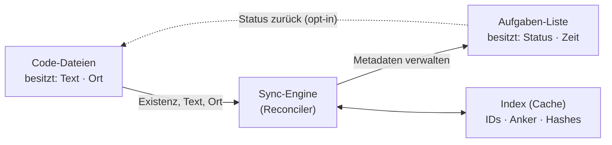

# Konzept: Code-TODOs & Aufgabenliste verschmelzen

Eine VS-Code-Extension, die auf den Ideen von **Todo+**, **Todo++** und **Todo Tree** aufbaut, aber deren getrennte Welten verbindet: verwaltete Aufgabenlisten in Plain-Text-Dateien einerseits, im Code verstreute `// TODO`-Kommentare andererseits. Ziel ist eine echte, aber konfliktarme Zwei-Wege-Synchronisation zwischen beiden.

---

## Leitidee: Eine Aufgabe, zwei Gesichter

Der Kern ist ein einziges Prinzip: Ein `// TODO` im Code und ein Eintrag in der Aufgabenliste sind **dasselbe Objekt**, nur in zwei Darstellungen. Eine Aufgabe lässt sich im Code bearbeiten _oder_ in der Liste — die Metadaten (Status, Zeit, Priorität) bleiben in beiden Fällen erhalten, und nichts geht verloren.

Daraus ergeben sich drei Aufgabentypen:

- **Code-verankert** — geboren als Kommentar im Code, an eine Zeile gebunden.
- **Frei** — existiert nur in der Liste, ohne Code-Bezug (z. B. „Deploy auf Prod", „Kunden anrufen").
- **Aufgewertet** — ein Code-TODO, das mit Metadaten angereichert wurde und dadurch eine stabile ID erhält.

---

## Zentrales Prinzip: Facetten-Eigentum

Naive Zwei-Wege-Sync scheitert fast immer daran, dass beide Seiten _dieselben Felder_ schreiben wollen, was zu Konflikten, kaputten Git-Diffs und Datenverlust führt. Die Lösung ist, nicht dieselben Felder hin- und herzusynchronisieren, sondern das **Eigentum an Facetten** aufzuteilen:

- **Der Code besitzt** Existenz, Text und Ort einer code-verankerten Aufgabe. Steht es nicht mehr im Code, ist die Aufgabe „weg" — wird aber archiviert, nicht gelöscht (siehe Vertrauensregel).
- **Die Liste / der Store besitzt** alles, was in eine einzeilige Kommentarzeile nicht passt: Status-Lifecycle, Zeiterfassung, Planungs-Tags (`@today` / `@thisweek`), Priorität, Notizen und optional Zuweisung.
- **Der Status darf zurück in den Code fließen** (z. B. „erledigt" → Kommentar wird zu `// DONE` oder gestrichen), aber nur als expliziter, konfigurierbarer Schritt, um ungewolltes Git-Rauschen zu vermeiden.

So wird aus dem Konflikt-Problem eine saubere Arbeitsteilung.

---

## Architektur



Die **Sync-Engine (Reconciler)** sitzt in der Mitte: Sie scannt den Code, gleicht ihn mit der Liste ab und nutzt dafür einen **Index** als regenerierbaren Cache. Die forward-Richtung (Code → Liste) ist die Entdeckung neuer TODOs; die return-Richtung (Status → Code) ist der vorsichtige, opt-in gehaltene Rückfluss.

---

## Identität — das schwierigste Problem

Damit ein Code-`// TODO` und ein Listeneintrag „dasselbe" bleiben, braucht es eine stabile Identität, die überlebt, wenn die Zeile sich verschiebt, der Text editiert oder die Datei umbenannt wird. Empfohlen wird ein **fauler ID-Mechanismus**:

Ein einfaches `// TODO: Loop refaktorieren` bleibt sauber und unberührt — es wird nur per Fuzzy-Matching (Textähnlichkeit plus letzte bekannte Position) wiedererkannt. Erst beim „Aufwerten" (Status, Zeiterfassung oder Termin dranhängen) injiziert die Extension eine kurze stabile ID:

```
// TODO: Loop refaktorieren (#7f3a)
```

Ab da ist die Zuordnung bombenfest, egal wie der Code wandert. Vorteil: Kommentare werden nur dort „verschmutzt", wo es einen echten Mehrwert gibt — das entschärft den Hauptkritikpunkt an ID-im-Kommentar-Ansätzen.

---

## Vertrauensregel: Löschen heißt archivieren

Die wichtigste Verlässlichkeitsregel: Verschwindet ein Code-Kommentar (gelöscht oder wegrefaktoriert), darf die Aufgabe samt erfasster Zeit **nicht still verschwinden**. Sie wandert in einen Archiv-/Verwaisten-Abschnitt der Liste, wo der Nutzer entscheidet: als erledigt markieren oder den Anker neu setzen. Ohne diese Regel verliert man Daten — und damit das Vertrauen in die Sync, was das Aus für jede solche Extension wäre.

---

## Datenmodell & Speicher

Als menschenlesbare Quelle dient eine **TaskPaper-/Todo+-kompatible Plain-Text-Datei**: git-freundlich, in jedem Editor lesbar und kompatibel mit dem bestehenden Ökosystem. Dazu kommt ein **Sidecar-Index** unter `.vscode/` (JSON oder SQLite), der IDs, letzte Zeilennummern und Content-Hashes cacht.

Die Datei ist die Wahrheit für Menschen; der Index ist nur ein regenerierbarer Cache für schnellen Abgleich und gehört nicht ins Git-Repo (`.gitignore`).

---

## Oberfläche — das Beste der drei Vorbilder

- Von **Todo Tree**: die Tree-View mit Sprung-zum-Code und das Editor-Highlighting.
- Von **Todo+**: die editierbare Listendatei mit Projekten, Verschachtelung, Tastaturkürzeln und Statusleisten-Timer.
- Von **Todo++**: der Fokus-View für `@today` / `@thisweek`.
- **Neu** als verbindendes Element: CodeLens- bzw. Gutter-Aktionen direkt am Kommentar („Aufwerten", „Erledigt", „Timer starten") sowie ein Status-Badge, das im Code anzeigt, dass diese Aufgabe verwaltet wird.

---

## Hint-Zeile am Kommentar (CodeLens)

Über jeder erkannten Markierung (`TODO`, `FIXME`, …) erscheint eine anklickbare Hint-Zeile (CodeLens). Sie zeigt den aktuellen Status und kontextabhängige Aktionen — die Buttons wechseln je nach Lebenszyklus der Aufgabe (Starten, Pausieren, Fortsetzen, Erledigt, Abbrechen, Archivieren).

Wichtig: Die **erste** Lifecycle-Aktion auf einem rohen TODO ist zugleich das „Aufwerten" aus dem Identitätskonzept — in diesem Moment injiziert die Extension die stabile ID und legt die Aufgabe im verwalteten Set an. Solange man nichts anklickt, bleibt der Kommentar völlig unberührt.

Der Status wird primär in der Hint-Zeile und in der Liste geführt, **nicht** in den Kommentartext geschrieben — mit Ausnahme der Endzustände „Erledigt"/„Abgebrochen", deren Schlüsselwort (z. B. `TODO` → `DONE`) optional und gebündelt in den Code zurückgeschrieben werden kann (siehe Facetten-Eigentum).

Beispiel der Hint-Zeile über einem laufenden TODO:

```
läuft · 00:12:34   |  Pausieren   |  Erledigt   |  Abbrechen
// TODO: Loop refaktorieren (#7f3a)
```

---

## Aufgaben-Lifecycle & Aktionen

| Status      | Hint-Zeile zeigt                     | Verfügbare Aktionen                                |
| ----------- | ------------------------------------ | -------------------------------------------------- |
| Offen       | offen                                | Starten · Erledigt · Abbrechen · Planen (`@today`) |
| Läuft       | läuft + Timer                        | Pausieren · Erledigt · Abbrechen                   |
| Pausiert    | pausiert + erfasste Zeit             | Fortsetzen · Erledigt · Abbrechen                  |
| Erledigt    | erledigt                             | Wieder öffnen · Archivieren                        |
| Abgebrochen | abgebrochen                          | Wieder öffnen · Archivieren                        |
| Archiviert  | (aus aktiven Ansichten ausgeblendet) | —                                                  |

„Starten" / „Pausieren" / „Fortsetzen" steuern die Zeiterfassung (Timer auch in der Statusleiste, wie bei Todo+). „Archivieren" verschiebt die Aufgabe in den Archiv-Abschnitt der Liste, ohne Daten zu verlieren (Vertrauensregel).

---

## Kommentar-Typen & Farbcodierung

Erkannte Typen werden im Editor farblich markiert (Schlüsselwort und/oder Zeile, wie bei Todo+ / TODO Highlight) und in der Tree-View mit Icon und Farbe gruppiert. Alle Typen, Farben, Icons und das zugrunde liegende Regex sind frei konfigurierbar — die folgende Liste ist der mitgelieferte Standard. Die Icon-Spalte nennt passende Codicon-Namen (`$(name)`), die VS Code bereits eingebaut hat.

| Typ                 | Bedeutung               | Farbe                  | Icon (Codicon)   |
| ------------------- | ----------------------- | ---------------------- | ---------------- |
| `TODO`              | geplante Aufgabe        | Blau                   | `circle-outline` |
| `FIXME`             | muss korrigiert werden  | Orange                 | `tools`          |
| `BUG`               | Defekt                  | Rot                    | `bug`            |
| `HACK`              | Workaround / Code-Smell | Amber                  | `flame`          |
| `NOTE`              | Hinweis / Info          | Grün                   | `note`           |
| `TEST`              | Test fehlt / offen      | Violett                | `beaker`         |
| `DEBUG`             | temporärer Debug-Code   | Magenta                | `terminal`       |
| `OPTIMIZE` / `PERF` | Performance-Thema       | Amber                  | `dashboard`      |
| `REVIEW`            | muss reviewt werden     | Pink                   | `eye`            |
| `IDEA`              | Idee / Vorschlag        | Cyan                   | `lightbulb`      |
| `WARNING` / `WARN`  | Achtung                 | Amber-Rot              | `warning`        |
| `DEPRECATED`        | veraltet                | Grau (durchgestrichen) | `archive`        |
| `XXX`               | kritische Markierung    | Rot                    | `error`          |

Zwei Markierungsebenen greifen ineinander: die **Typ-Farbe** (TODO vs. FIXME vs. BUG …) und ein **Status-Overlay** über den Lebenszyklus — „Erledigt" wird durchgestrichen und gedimmt, „Abgebrochen" gedimmt, „Läuft" erhält einen Gutter-Akzent. Die Farben sollten als `ThemeColor` definiert werden, damit sie sich Hell-/Dunkel-Theme anpassen, und immer mit einem Icon kombiniert sein (nie nur Farbe — Barrierefreiheit).

---

## Gruppierung & Ansichten

Die Tree-View lässt sich — wie bei Todo Tree umschaltbar — nach verschiedenen Achsen gruppieren, ergänzt um die zeitbasierte Fokus-Gruppierung von Todo++:

- **Nach Typ** — TODO, FIXME, BUG … als Gruppenknoten (das, was die Typ-Liste oben nahelegt).
- **Nach Datei / Ordner** — klassische Baumstruktur.
- **Nach Status** — Offen, Läuft, Pausiert, Erledigt, Archiviert.
- **Nach Zeitplan** — Heute, Diese Woche, Ohne Termin (die `@today` / `@thisweek`-Logik aus Todo++).
- **Nach Projekt** — die Projekt-Struktur der Todo+-Datei.

Zusätzlich ein dedizierter **Fokus-View** (Todo++), der nur `@today` / `@thisweek` zeigt — als schneller „Was ist jetzt dran"-Blick, unabhängig von der Hauptgruppierung.

---

## Abgrenzung zu den Vorbildern

Todo Tree ist read-only — keine Status-Historie, keine Zeiterfassung, Kommentare sind flüchtig. Todo+ verwaltet stark, ist aber bei Code-Kommentaren blind (sein „embedded todos"-View ist nur eine separate Leseansicht, nicht in die verwaltete Liste integriert). Das Alleinstellungsmerkmal ist genau die Brücke dazwischen: eine Aufgabe, zwei Gesichter, Metadaten persistent, nichts geht verloren.

---

## Scanner ohne ripgrep (Cross-Platform)

Hintergrund: Die textsuchenden VS-Code-APIs (`findTextInFiles`, die neueren `findFiles2` / `textSearchProviderNew`) sind weiterhin instabile „proposed" APIs, die nur in Insiders verfügbar sind und nicht in veröffentlichten Extensions verwendet werden sollten. Außerdem rufen Extensions wie Todo Tree ripgrep teils über den Namen `rg` via PATH auf — schlägt der Lookup fehl, kommt die „install ripgrep"-Fehlermeldung.

Die Lösung: ein **Standard-Scanner in reinem TypeScript** auf Basis der _stabilen_ APIs, ganz ohne native Abhängigkeit.

- **Dateifindung** über `workspace.findFiles(include, exclude)` — plattformneutral, respektiert die `files.exclude` / `search.exclude`-Einstellungen (so fällt `node_modules` etc. automatisch raus).
- **Lesen** mit `workspace.fs.readFile` (liefert ein `Uint8Array`, als UTF-8 dekodieren); für offene Dateien direkt das In-Memory-`TextDocument` ohne Festplattenzugriff.
- **Finden** der Tags per Zeilen-Regex in JS.

Damit ist der Scanner auf macOS, Linux und Windows identisch, weil kein externer Prozess und kein Binary im Spiel ist.

### Cross-OS-Stolpersteine, die dadurch wegfallen

- Zeilenenden mit `/\r?\n/` splitten (Windows-CRLF vs. Unix-LF).
- Ein eventuelles BOM beim Dekodieren abschneiden.
- Niemals mit hartkodiertem `/` als Pfadtrenner arbeiten — durchgängig `Uri` und `workspace.asRelativePath` verwenden. (Die Glob-Muster in `findFiles` nutzen auf allen Systemen Vorwärts-Slashes; das normalisiert VS Code selbst.)
- Binärdateien per Null-Byte-Heuristik im ersten Lesepuffer überspringen, sehr große Dateien per Größenobergrenze.

### Profil- / Settings-Sync-Punkt

Würde je ein Binary-Pfad in eine Einstellung geschrieben, würde Settings Sync z. B. einen macOS-Pfad auf einen Windows-Rechner übertragen und dort brechen. Der JS-Scanner braucht keinen Pfad, also existiert das Problem für den Standardfall nicht. Falls später optional ein schnellerer Provider angeboten wird, gilt: niemals einen absoluten Pfad in synchronisierten Settings ablegen, sondern zur Laufzeit pro Maschine auflösen — und bei Nichtverfügbarkeit still auf den JS-Scanner zurückfallen statt einen harten Fehler zu werfen.

### Optionaler Schnell-Provider (rein zusätzlich, nie Pflicht)

Für sehr große Monorepos kann eine Einstellung wie `taskSync.scanner.provider` mit den Werten `js` (Default), `bundledRipgrep` und `auto` vorgesehen werden. Wird ripgrep überhaupt eingebunden, dann das von VS Code bereits mitgelieferte Binary über das `@vscode/ripgrep`-Paket (dessen `rgPath` zeigt auf das vorhandene Binary), nicht über einen PATH-Lookup. `auto` heißt: schnellen Provider versuchen, bei jedem Fehlschlag lautlos auf `js` zurückfallen. „Funktioniert einfach überall" bleibt so die Garantie, Geschwindigkeit ist nur ein Bonus.

### Performance des JS-Scanners

Der Initialscan läuft als `findFiles` plus gebündeltes Einlesen mit Fortschrittsanzeige. Danach inkrementell: ein `FileSystemWatcher` auf Anlegen/Speichern/Löschen rescannt nur die betroffene Datei, und `onDidChangeTextDocument` (entprellt) scannt den In-Memory-Text der offenen Datei. Ergebnisse landen im Index, sodass nach dem ersten Durchlauf praktisch nie wieder alles gescannt wird.

---

## Risiken

- **Identitätsstabilität** beim Refactoring — Fuzzy-Matching ist nie perfekt.
- **Git-Rauschen** beim Zurückschreiben in den Code — deshalb opt-in und gebündelt, nie bei jedem Tastendruck.
- **Performance** in Monorepos — inkrementeller Scan nur auf geänderten Dateien statt Voll-Scan.

---

## Roadmap

**Phase 0 — Fundament.** Extension scaffolden (`yo code`, TypeScript). Nativ-freien JS-Scanner über `findFiles` + `fs.readFile` + Zeilen-Regex bauen (inkl. CRLF- und Binär-Handling), inkrementell per Watcher. TaskPaper-/Todo+-Datei parsen. Reines Lesen, noch keine Sync. Ziel: Tree-View, die Code-TODOs _und_ Listeneinträge nebeneinander zeigt.

**Phase 1 — Einweg-Sync & Index.** Sidecar-Index einführen (IDs, Anker, Hashes). Code-TODOs automatisch in einen „Inbox"-Abschnitt der Liste spiegeln. Fuzzy-Matching für Wiedererkennung beim erneuten Scan. Watcher auf Speichern/Datei-Änderung.

**Phase 2 — Aufwerten & Rückschreiben.** CodeLens-Aktion „Aufwerten" injiziert die ID und verschiebt die Aufgabe ins verwaltete Set. Status-Rückfluss in den Code (opt-in, gebündelt). Archiv-/Verwaisten-Logik für gelöschte Kommentare — die Vertrauensregel.

**Phase 3 — Reichhaltige Verwaltung.** Zeiterfassung plus Statusleisten-Timer, Planungs-Tags, Fokus-View (`@today` / `@thisweek`), Editor-Decorations und Status-Badges am Kommentar.

**Phase 4 — Politur.** Konfigurierbare Rückschreib-Strategien (DONE-Marker vs. löschen vs. streichen), Multi-Root-/Monorepo-Performance, Konflikt-UI, Marketplace-Veröffentlichung.

Der riskanteste Teil steckt in Phase 1/2 (Identität plus Rückschreiben) — am besten früh als Durchstich-Prototyp validieren, bevor in die reichhaltigen Features investiert wird.

---

## Namensvorschläge

Bewusst keine „Todo+++"-Ableitungen, sondern eigenständige Namen, die zum Kernbild passen: Marker im Code, die zu echten Aufgaben werden, und das Zusammenführen zweier Welten. Die generischen „Todo …"-Namen sind im Marketplace ohnehin überfüllt; die folgenden sind deutlich distinktiver.

| Name            | Idee dahinter                                                                                                                                                                                            |
| --------------- | -------------------------------------------------------------------------------------------------------------------------------------------------------------------------------------------------------- |
| **Cairn**       | Steinmännchen markieren Wanderwege — genau wie TODOs Markierungen im Code sind, die einen leiten. Kurz, einprägsam, im Todo-Umfeld kaum besetzt. _(Top-Empfehlung)_                                      |
| **Concordance** | Eine Konkordanz ist ein Index, der zeigt, _wo_ Begriffe in einem Text vorkommen — perfekt für das Indizieren von Code-Annotationen. „Concord" trägt zugleich die Bedeutung von Übereinstimmung/Abgleich. |
| **Tether**      | Aufgaben sind an Code-Stellen „angeleint" — eine bidirektionale Verbindung. Drückt das Anker-Prinzip direkt aus.                                                                                         |
| **Marginalia**  | Randnotizen im Text — charmant und literarisch, passend für Kommentare-als-Notizen, die zu Aufgaben werden.                                                                                              |
| **Lodestar**    | Leitstern zur Orientierung; passt zum Wayfinding-Bild der Marker.                                                                                                                                        |
| **Anchora**     | Ableitung von „Anchor" — Aufgaben, die im Code verankert sind.                                                                                                                                           |
| **Weft**        | Der Querfaden, der durch die Kettfäden gewebt wird — zwei Systeme (Code + Liste) ineinander verwoben. Ungewöhnlich, aber treffend.                                                                       |
| **Beacon**      | Code-Marker als Leuchtfeuer, die in einer Tree-View auftauchen. _(häufiger Name — Verfügbarkeit prüfen)_                                                                                                 |
| **Dovetail**    | Die Schwalbenschwanz-Verbindung verzahnt zwei Teile nahtlos — Bild für das Verschmelzen von Code und Liste. _(als Produktname teils belegt — prüfen)_                                                    |
| **Pinpoint**    | Aufgaben präzise an Codezeilen „angepinnt".                                                                                                                                                              |

**Empfehlung:** _Cairn_ als erste Wahl (prägnant, passendes Bild, im Umfeld frei), _Concordance_ als zweite (beschreibt die Index-/Abgleich-Funktion exakt).

> Hinweis: Vor der finalen Wahl Verfügbarkeit prüfen — VS-Code-Marketplace, npm-Paketname und die Eindeutigkeit der Publisher-/Extension-ID (`publisher.extensionId`).
