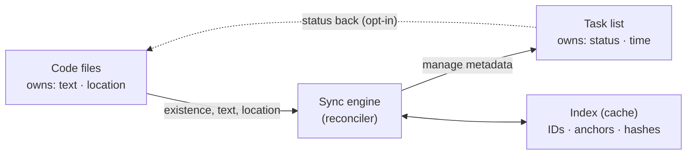

# Roadmap

This document captures the long-term vision for TODO Beacon and the concrete features planned beyond the current release. It supersedes `CONCEPT.md` (the original design document, in German) — once everything below is confirmed to cover its content, that file can be deleted without losing anything.

## Vision: one task, two faces

A `// TODO` in code and an entry in the task list are **the same object**, just shown two ways. A task can be edited in the code _or_ in the list — metadata (status, time, priority) survives either way, and nothing is lost.

This gives three kinds of tasks:

- **Code-anchored** — born as a comment in code, bound to a line.
- **Free** — exists only in the list, with no code reference (e.g. "Deploy to prod", "Call client").
- **Promoted** — a code TODO that has been enriched with metadata and thereby gained a stable ID.

## Core principle: facet ownership

Naive two-way sync almost always breaks because both sides want to write the _same_ fields, causing conflicts, broken git diffs, and data loss. The fix is to split **ownership of facets** instead of syncing the same fields back and forth:

- **Code owns** the existence, text, and location of a code-anchored task. If it disappears from code, the task is "gone" — but archived, never deleted (see Trust Rule below).
- **The list/store owns** everything that doesn't fit on a single comment line: status lifecycle, time tracking, scheduling tags (`@today` / `@thisweek`), priority, notes, and optional assignment.
- **Status may flow back into code** (e.g. "done" → comment becomes `// DONE` or is struck through), but only as an explicit, configurable, opt-in step to avoid unwanted git noise.

This turns the conflict problem into a clean division of labor.

## Architecture



The **sync engine (reconciler)** sits in the middle: it scans code, reconciles it with the list, and uses an **index** as a regenerable cache. The forward direction (code → list) discovers new TODOs; the return direction (status → code) is the careful, opt-in flow back.

## Identity — the hardest problem

For a code `// TODO` and a list entry to stay "the same" thing, identity needs to survive the line moving, the text being edited, or the file being renamed. The recommended approach is **lazy ID injection**:

A plain `// TODO: refactor loop` stays clean and untouched — it's re-recognized via fuzzy matching (text similarity plus last known position). Only when "promoted" (status, time tracking, or a schedule attached) does the extension inject a short stable ID:

```
// TODO: refactor loop (#7f3a)
```

From then on, the match is rock-solid no matter how the code moves. Comments are only "polluted" where it adds real value, which defuses the main criticism of ID-in-comment approaches.

## Trust rule: deleting means archiving

The most important reliability rule: if a code comment disappears (deleted or refactored away), the task — and any time logged against it — must **never silently disappear**. It moves to an archive/orphaned section of the list, where the user decides: mark done, or re-anchor it. Without this rule, data is lost, and with it trust in the sync — which would be the end of any such extension.

## Data model & storage

The human-readable source of truth is a **TaskPaper-/Todo+-compatible plain-text file**: git-friendly, readable in any editor, compatible with the existing ecosystem. Alongside it, a **sidecar index** under `.vscode/` (JSON or SQLite) caches IDs, last-known line numbers, and content hashes.

The file is the source of truth for humans; the index is just a regenerable cache for fast reconciliation and does not belong in git (`.gitignore`).

## Surface — best of three predecessors

- From **Todo Tree**: the tree view with jump-to-code and editor highlighting.
- From **Todo+**: the editable list file with projects, nesting, keybindings, and a status bar timer.
- From **Todo++**: the focus view for `@today` / `@thisweek`.
- **New**, as the connective element: CodeLens/gutter actions right on the comment ("Promote", "Done", "Start timer") plus a status badge in the code showing that a task is managed.

## Planned: hint line on the comment (CodeLens)

Above every recognized tag (`TODO`, `FIXME`, …), a clickable hint line (CodeLens) would show current status and context-dependent actions — buttons that change with the task's lifecycle (Start, Pause, Resume, Done, Cancel, Archive).

Important: the **first** lifecycle action on a raw TODO is also the "promotion" from the identity concept — at that moment the extension injects the stable ID and creates the task in the managed set. Until something is clicked, the comment stays completely untouched.

Status lives primarily in the hint line and the list, **not** written into the comment text — except for the terminal states "Done"/"Cancelled", whose keyword (e.g. `TODO` → `DONE`) can optionally be written back into code as a bundled, opt-in change (see Facet Ownership).

Example hint line above a running TODO:

```
running · 00:12:34   |  Pause   |  Done   |  Cancel
// TODO: refactor loop (#7f3a)
```

## Planned: task lifecycle & actions

| Status    | Hint line shows         | Available actions                          |
| --------- | ------------------------ | -------------------------------------------- |
| Open      | open                      | Start · Done · Cancel · Plan (`@today`)      |
| Running   | running + timer           | Pause · Done · Cancel                        |
| Paused    | paused + time logged      | Resume · Done · Cancel                       |
| Done      | done                       | Reopen · Archive                              |
| Cancelled | cancelled                 | Reopen · Archive                              |
| Archived  | (hidden from active views) | —                                            |

Start / Pause / Resume drive time tracking (timer also shown in the status bar, like Todo+). Archive moves the task into the list's archive section without losing data (Trust Rule).

## Planned: tag colors

Recognized tags should be color-highlighted in the editor (keyword and/or whole line) and grouped with an icon and color in the tree view. All tags, colors, icons, and the underlying regex should stay user-configurable — the table below is the shipped default. The icon column names matching built-in VS Code codicons (`$(name)`).

| Tag                 | Meaning                | Color                  | Icon (codicon)   |
| -------------------- | ----------------------- | ----------------------- | ----------------- |
| `TODO`               | planned task             | blue                     | `circle-outline`  |
| `FIXME`               | needs correcting         | orange                   | `tools`            |
| `BUG`                 | defect                   | red                      | `bug`              |
| `HACK`                | workaround / code smell  | amber                    | `flame`            |
| `NOTE`                | hint / info               | green                    | `note`             |
| `TEST`                | missing/open test        | violet                   | `beaker`           |
| `DEBUG`               | temporary debug code      | magenta                  | `terminal`         |
| `OPTIMIZE` / `PERF`  | performance topic         | amber                    | `dashboard`        |
| `REVIEW`              | needs review               | pink                     | `eye`              |
| `IDEA`                | idea / suggestion          | cyan                     | `lightbulb`        |
| `WARNING` / `WARN`   | caution                    | amber-red                | `warning`          |
| `DEPRECATED`          | outdated                   | gray (strikethrough)     | `archive`          |
| `XXX`                 | critical marker             | red                      | `error`            |

Two marking layers would work together: the **type color** (TODO vs. FIXME vs. BUG, …) and a **status overlay** over the lifecycle — "Done" struck through and dimmed, "Cancelled" dimmed, "Running" gets a gutter accent. Colors should be defined as `ThemeColor` so they adapt to light/dark themes, and always paired with an icon (never color alone, for accessibility).

## Planned: grouping & views

The tree view should be switchable between several grouping axes — like Todo Tree — plus the time-based focus grouping from Todo++:

- **By type** — TODO, FIXME, BUG, … as group nodes (today's only grouping).
- **By file/folder** — classic tree structure.
- **By status** — Open, Running, Paused, Done, Archived.
- **By schedule** — Today, This Week, No date (the `@today` / `@thisweek` logic from Todo++).
- **By project** — the project structure from the TaskPaper/Markdown file (today's only structuring, via headings/projects).

Plus a dedicated **Focus view** (Todo++-style) showing only `@today` / `@thisweek` — a quick "what's next" glance, independent of the main grouping.

## How this differs from its inspirations

Todo Tree is read-only — no status history, no time tracking, comments are ephemeral. Todo+ manages tasks well but is blind to code comments (its "embedded todos" view is a separate read-only view, not integrated into the managed list). The differentiator is exactly the bridge between them: one task, two faces, metadata persists, nothing is lost.

## Cross-platform scanner (no ripgrep)

Background: VS Code's text-search APIs (`findTextInFiles`, the newer `findFiles2` / `textSearchProviderNew`) are still unstable "proposed" APIs, Insiders-only, and shouldn't be used in published extensions. Some extensions (e.g. Todo Tree) also invoke ripgrep via the `rg` name on `PATH` — when that lookup fails, users see an "install ripgrep" error.

The solution, already implemented as the default: a **pure-TypeScript scanner** on stable APIs only, with no native dependency.

- **File discovery** via `workspace.findFiles(include, exclude)` — platform-neutral, respects `files.exclude` / `search.exclude` settings.
- **Reading** via `workspace.fs.readFile` (decoded as UTF-8); for open files, the in-memory `TextDocument` directly, no disk access.
- **Tag matching** via a line-based regex in JS.

This keeps the scanner identical on macOS, Linux, and Windows since no external process or binary is involved.

### Cross-OS pitfalls this avoids

- Splitting line endings with `/\r?\n/` (Windows CRLF vs. Unix LF).
- Stripping a possible BOM when decoding.
- Never hardcoding `/` as a path separator — using `Uri` and `workspace.asRelativePath` throughout.
- Skipping binary files via a null-byte heuristic on the first read buffer, and very large files via a size cap.

### Settings Sync pitfall to avoid

If a binary path were ever written into a setting, Settings Sync could carry e.g. a macOS path to a Windows machine and break there. The JS scanner needs no path, so this doesn't apply to the default. If a faster provider is added later: never store an absolute path in synced settings — resolve it per-machine at runtime, and silently fall back to the JS scanner if unavailable, instead of throwing a hard error.

### Planned: optional fast provider (purely additive, never required)

For very large monorepos, a setting like `todo-beacon.scanner.provider` with values `js` (default), `bundledRipgrep`, and `auto` could be offered. If ripgrep is ever wired in, it should be VS Code's own bundled binary via the `@vscode/ripgrep` package (whose `rgPath` points at the binary already present), never a `PATH` lookup. `auto` means: try the fast provider, silently fall back to `js` on any failure. "Just works everywhere" stays the guarantee; speed is only a bonus.

### Scanner performance

The initial scan runs as `findFiles` plus batched reads with a progress indicator. After that, incrementally: a `FileSystemWatcher` on create/save/delete rescans only the affected file, and a debounced `onDidChangeTextDocument` scans the in-memory text of the open file. Results land in the index, so after the first pass a full rescan is effectively never needed again.

## Risks

- **Identity stability** under refactoring — fuzzy matching is never perfect.
- **Git noise** from writing back into code — hence opt-in and bundled, never on every keystroke.
- **Performance** in monorepos — incremental scanning of changed files only, not full rescans.

## Status

### Done (v0.1.0)

- [x] Pure-TypeScript, cross-platform code scanner (`workspace.findFiles` + `fs.readFile` + line regex), no native dependency.
- [x] Configurable comment tags, with a colon required and the tag required to sit inside a comment (no false positives from CSS selectors, Markdown headings, etc.).
- [x] Configurable exclude globs, with sensible per-language build/cache folder defaults.
- [x] TaskPaper (`.todo`) and Markdown checkbox task file parsing, with auto-detection.
- [x] Markdown heading hierarchy preserved as a nested tree (indentation + cascading collapse).
- [x] Code TODOs grouped by tag, fixed priority order, click-to-navigate.
- [x] Task List click-to-navigate.
- [x] Auto-refresh via file watcher, manual refresh command.
- [x] Stable ID extraction from `(#xxxx)` markers (read-only so far — see Phase 2 for injection).

### Phase 1 — One-way sync & index

- [ ] Sidecar index (IDs, anchors, hashes) under `.vscode/`.
- [ ] Auto-mirror code TODOs into an "inbox" section of the task list (`todo-beacon.autoAddToInbox`).
- [ ] Fuzzy matching to re-recognize tasks across rescans.

### Phase 2 — Promotion & write-back

- [ ] "Promote to managed task" action that injects a stable ID (`todo-beacon.idInjection`, `todo-beacon.idTemplate`).
- [ ] Status write-back into code, opt-in and bundled (`todo-beacon.writeBack.onDone`, `todo-beacon.writeBack.onCancel`, `todo-beacon.writeBack.doneKeyword`).
- [ ] Archive/orphan handling for deleted comments (the Trust Rule).

### Phase 3 — Rich management

- [ ] Time tracking: Start / Pause / Resume / Done / Cancel / Archive / Reopen, with a status bar timer (`todo-beacon.timeTracking.enabled`, `todo-beacon.statusBar.enabled`).
- [ ] Scheduling tags (`@today` / `@thisweek`) and a dedicated **Focus view**.
- [ ] Editor decorations: per-tag colors and status overlays (`todo-beacon.decorations.enabled`, `todo-beacon.decorations.target`, `todoBeacon.*Foreground` theme colors).
- [ ] CodeLens hint line with lifecycle actions above each tag (`todo-beacon.codeLens.enabled`).
- [ ] Grouping switcher: by type / file / status / schedule / project (`todo-beacon.grouping`, `todo-beacon.changeGrouping` command).

### Phase 4 — Polish

- [ ] Optional fast scanner provider using VS Code's bundled ripgrep, with silent fallback (`todo-beacon.scanner.provider`).
- [ ] Multi-root/monorepo performance tuning.
- [ ] Conflict UI for ambiguous fuzzy-matches.
- [ ] Marketplace publishing.

The riskiest part is Phase 1/2 (identity plus write-back) — best validated early with a thin vertical slice before investing in the rich features of Phase 3.
